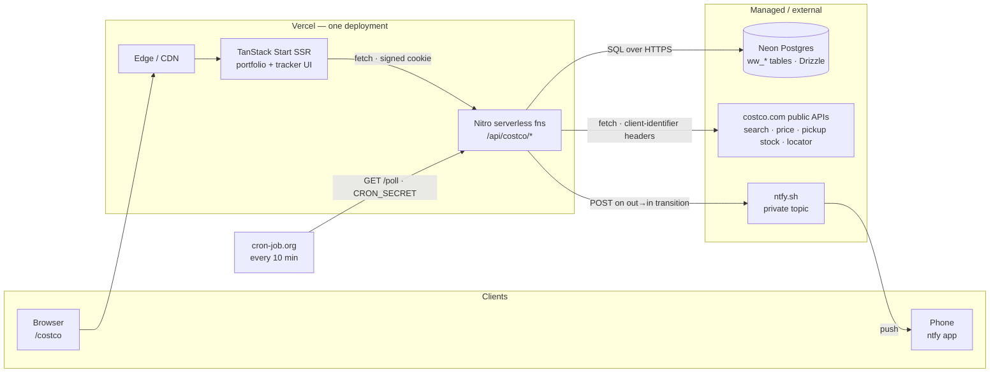

# Warehouse Watch — Costco tracker at `/costco`

A subscription-free alternative to "Warehouse Runner"-style Costco apps, built
into this portfolio as a real feature: live full-catalog search, real Costco
prices and promotions, **true per-warehouse in-warehouse stock**, region-wide
availability scans, and back-in-stock push alerts — all from Costco's own
public endpoints. No Costco login, no headless browser, no scraping HTML.

- UI: `apps/web/src/routes/costco/` (TanStack Start + Tailwind v4, site theme)
- API: `apps/web/src/routes/api/costco/` (Nitro server handlers)
- Engine: `apps/web/src/server/costco/` (Drizzle pg-core + Neon, async services)
- Diagram: [`system-design.html`](./system-design.html) · endpoint notes: [`data-sources.md`](./data-sources.md)

## System design

Everything stateless lives on Vercel; everything stateful lives in Neon. The
functions are the only component that talks to Costco, and the free external
scheduler is the only thing that "runs" when nobody is looking — one GET every
ten minutes stands in for the background process a VPS would provide.

### Life of a request (checking an item's warehouse stock)

1. `/costco` is served SSR from the same deployment as the portfolio.
2. The UI calls `POST /api/costco/items/:id` `{action:'stock'}` with the
   signed session cookie.
3. The function loads the item's pricing child-id from Neon, then fans out to
   Costco's `inventorylevels/availability/pickup` endpoint once per tracked
   warehouse (concurrency-capped for free-tier `maxDuration`).
4. Results are persisted (`ww_warehouse_items`) and returned:
   in stock / low / out / not sold — per physical warehouse.

### Life of an alert (back-in-stock push)

1. cron-job.org fires `GET /api/costco/poll?key=CRON_SECRET`.
2. The poll function re-checks every watch (online stock or tracked-warehouse
   stock, per the watch's scope) against Costco.
3. It diffs against last-known state in Neon — only an **out → in** transition
   counts, so you're pinged on the change, not every cycle.
4. On a transition it POSTs to the private ntfy topic; the ntfy app pushes to
   the phone. (Web Push can slot in beside this later — same poller.)

## The data story (the interesting part)

Costco has no public API. The feature runs on reverse-engineered endpoints the
costco.com frontend itself calls — documented with headers and gotchas in
[`data-sources.md`](./data-sources.md). Highlights:

| Capability | Endpoint family | Notes |
| --- | --- | --- |
| Full-catalog search | `gdx-api…/catalog/search/api/v1/search` | **POST** (GET → 403); needs `locale` + `searchresultprovider: GRS` headers; returns items the sitemaps omit |
| Price + promotions | `gdx-api…/dispprice-api/v2/display-price-lite` | national price, active deals w/ end dates — powers "biggest savings" |
| **Per-warehouse stock** | `ecom-api…/inventorylevels/availability/pickup/{childId}?selectedWarehouse={n}-wh` | INSTOCK / LOWSTOCK / NOSTOCK per building; empty = not sold there |
| Warehouse locator | `ecom-api…/warehouse-locator/v1/salesLocations.json` | all warehouses near lat/lng; ZIP via geocode service |
| Item metadata | `gdx-api…/product-api/v1/products/summary` | batchable; resolves discontinued items search can't find |

All plain server-side `fetch` with static per-service `client-identifier`
headers — no membership, no browser. Prices are fetched lazily per item (6h
TTL) and search results self-heal the local catalog on every query.

## Setup (one time, ~10 minutes, free)

1. **Neon**: Vercel project → Storage → Create Database → **Neon** (adds
   `DATABASE_URL`).
2. **`apps/web/.env`**: `DATABASE_URL` plus `APP_PASSWORD`, `SESSION_SECRET`,
   `NTFY_TOPIC`, `CRON_SECRET`.
3. **Tables**: `cd apps/web && npm run db:push` (drizzle-kit).
4. **Vercel env**: same vars + `PUBLIC_URL=https://<domain>`.
5. **Scheduler**: cron-job.org → `GET https://<domain>/api/costco/poll?key=<CRON_SECRET>`
   every 10 minutes.
6. **Phone**: install ntfy, subscribe to the `NTFY_TOPIC` string.

### Free-tier fitting

- Alert cadence comes from the external scheduler, not Vercel Cron (Hobby cron
  is ~daily).
- The region scan (~80 warehouses) runs at concurrency 10 ≈ 3s — inside the
  Hobby function ceiling.
- Deal scans price a bounded batch (≤60) per invocation; re-run (or cron) to
  accumulate coverage.

## Provenance

Ported from the standalone app at `~/warehouse-watch` (Fastify + SQLite +
node-cron, still runnable) — probe scripts there under `scripts/` captured the
endpoints. The port swapped better-sqlite3 → Neon (schema unchanged, queries
made async), Fastify routes → TanStack Start server handlers, node-cron → the
external pinger, and Mantine → Tailwind on the site's own tokens.
